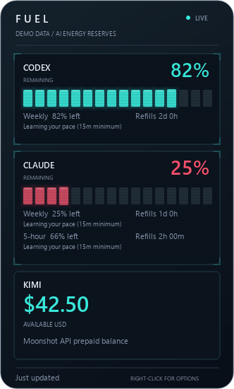

# Fuel

A small Windows overlay for AI allowances and prepaid balances. Collapses to a pill, expands on hover, and discovers supported apps on your computer.

**No AI models are called by Fuel.** It makes read-only usage/balance requests and calculates forecasts locally with arithmetic. It sends no prompts, creates no inference sessions, and consumes no model tokens. Ordinary endpoint rate limits and small network traffic still apply.



## Try it on Windows

Requires Windows 10/11 (x64), Python 3.11 or later, and Node.js. For the Codex meter, install the Codex CLI (`npm install -g @openai/codex`) and sign in with `codex login`. For the Claude meter, install Claude Code and sign in there too. Each meter reads your own local sign-in; missing accounts remain disconnected.

Clone or extract this repository into a folder you will keep. Open PowerShell in that folder and run:

```powershell
powershell -NoProfile -ExecutionPolicy Bypass -File .\setup.ps1
```

This creates a local Python environment, installs the pinned dependencies, and starts Fuel with automatic sign-in startup. No administrator rights should be needed. The scheduled task is `AI Fuel Widget`. If Task Scheduler is restricted by your organisation, use `setup.ps1 -NoStartup` and open `Start Fuel.cmd` manually; automatic recovery after reboot will not be installed in that mode.

For a custom Codex binary location, set `CODEX_BINARY` to the full `codex.exe` path. A custom Claude settings folder can be supplied with `CLAUDE_CONFIG_DIR`; a custom Node executable with `FUEL_NODE`. The default Codex discovery supports its standard per-user npm installation on Windows x64. macOS/Linux are not supported.

## How it works

Hover over the small pill near the top-right to see glowing segmented energy meters. Move away to collapse. Native Qt painting provides staggered segment fills, scanlines and corner brackets. Cyan means over 60% remaining, amber means 30-60%, and red means below 30%. Animation targets 60 fps when expanded and four updates per second when collapsed. Wheel scrolling reveals more apps without growing beyond the display. Right-click for refresh, position reset, animation preferences, or Quit. Reopen with `Start Fuel.cmd` after quitting.

## Provider support

Discovery runs in a background worker every 90 seconds. Finding an app does not imply Fuel can read its quota. Only verified provider responses produce percentages or money values.

| Provider or app | What Fuel shows | Connection |
| --- | --- | --- |
| Codex | Account allowances and reset forecasts | Installed Codex CLI sign-in |
| Claude | Session, weekly and returned model-specific limits | Claude Code sign-in |
| Kimi / Moonshot API | Prepaid USD balance | Existing `KIMI_API_KEY` or `MOONSHOT_API_KEY` |
| Kimi Code | Coding-plan windows, experimental adapter | `KIMI_CODE_API_KEY` or a `sk-kimi-` key |
| OpenRouter | Key spending cap remaining, or uncapped status | `OPENROUTER_API_KEY` |
| Hermes | Its underlying provider's usage, with no redundant agent card | `HERMES_HOME/config.yaml` or `~/.hermes/config.yaml` |
| Ollama | Loaded models and VRAM, no quota percentage | Running local API on port 11434 |
| LM Studio | Loaded models, no quota percentage | v1 local API on port 1234; optional `LM_API_TOKEN` |
| Cursor, Gemini, Windsurf, Copilot and other recognised AI apps | Listed under Other detected apps in the right-click menu when usage is unavailable | Known app folders, CLI presence and Windows installed-app names |

Known-app discovery also recognises Jan, GPT4All, AnythingLLM, Msty, Chatbox and several API-key environments. Other installed desktop names containing AI, LLM, GPT or Copilot are listed in the menu. The main panel shows only connected provider adapters, not agent names or placeholder app cards. Browser-only apps, arbitrary portable executables and every future AI app cannot be discovered universally. Add adapters in `providers.py` to turn detected status into real usage. ChatGPT chat allowances are not inferred from the separate Codex meter.

Allowlisted provider keys are read from existing process/user environment variables or Hermes' existing `.env`, in memory only. Fuel does not copy keys into its files, inspect browser cookies, or read conversation content. Hermes is linked rather than counted as a second allowance. Changing a Windows user environment variable can be detected without restarting Fuel. Editing a process-only environment requires restarting it.

Adapter references: [OpenRouter current-key API](https://openrouter.ai/docs/api/api-reference/api-keys/get-current-api-key), [Ollama running-model API](https://docs.ollama.com/api/ps), [LM Studio models API](https://lmstudio.ai/docs/developer/rest/list), [Hermes configuration](https://hermes-agent.nousresearch.com/docs/user-guide/configuration). Provider APIs can change. Kimi Code, OpenRouter and local model adapters have fixture coverage but were not authenticated against a live account during the original build; Codex, Claude and Moonshot balance were verified live.

Each tank shows the lowest remaining allowance across its account's session and weekly windows. Separate window percentages and refill countdowns appear underneath. A blocked Codex account shows an empty tank. Unknown data shows `--`; connection failures keep the last known number and label it. No guessed refill is applied when a reset time passes. Usage is polled every 90 seconds, independently for each provider, without sending a model prompt or purchasing credits.

Codex uses the installed CLI's read-only app-server account/rateLimits/read method. Claude uses its usage endpoint with the existing Claude Code credential file. Credentials are read in memory, never copied into this project or written to logs. Authentication is owned by the existing apps; sign into Claude Code or Codex again if needed. The Claude endpoint is not a guaranteed public API and may change.

The installed Task Scheduler task starts at Windows sign-in. Its hidden supervisor waits on the actual Python GUI process and restarts unexpected exits after three seconds. Scheduler-level failure retries are every minute up to 999 times, with a five-minute fallback trigger. The task ignores duplicate launches, permits battery operation and has no time limit. Named Windows mutexes prevent duplicate supervisors and widgets. Quit creates `state/paused`, which every automatic launch respects. Start Fuel removes that marker. Disabling the scheduled task also prevents automatic startup.

Requires Windows sign-in after reboot. Cannot display above Windows secure desktop or guarantee exclusive fullscreen games. `state/health.json` contains local process heartbeat and feed status, including balances and forecasts. Local state, dependencies and credentials are excluded from Git. The published screenshot uses explicitly labelled demo data, not a real person's usage or balance.

Forecasts use the consumption between the first and last reading in up to two hours of recent, continuous history for each allowance separately. They require at least 15 minutes, six readings and two percentage points of consumption. Estimated exhaustion is the last observation time plus remaining allowance divided by observed consumption per second. The display compares that time with the provider's actual reset timestamp. This extrapolates recent pace, including idle time; it does not predict future work or assume the whole week will resemble a busy session. It is labelled as an estimate. A plus duration on a safe forecast is the projected buffer beyond reset.

History is persisted locally in `state/usage-history.json`. Changed resets (with 60-second tolerance for endpoint timestamp jitter), refills/corrections and gaps over ten minutes start a new series. Stale data and connection failures pause forecasts. Low or unmeasurable usage stays in the learning state instead of claiming unlimited capacity. Forecasts require an actual reset time; prepaid balances do not pretend to have one. The expanded panel adapts to its content and is capped at 650 pixels tall; the collapsed pill remains 72x32.

## Checks and troubleshooting

Run `.venv/Scripts/python.exe -m unittest discover` for allowance, forecast and provider tests. Run `.venv/Scripts/python.exe feeds.py` for live core connection checks. `check_ui.py` checks hover sizes and scrolling; `check_ui.py --demo` renders safe illustrative screenshots. `install.ps1` refuses to overwrite an existing task. To remove startup, quit Fuel and remove `AI Fuel Widget` in Task Scheduler.

Verified on the original Windows machine: authenticated core feeds and Moonshot balance, 24 unit tests, hover rendering, duplicate prevention and process crash recovery. Reboot and installation on a second PC have not been tested. If a feed cannot connect, sign in again in its CLI, then use Fuel's Refresh usage option. Provider changes may require an update to the usage readers.
